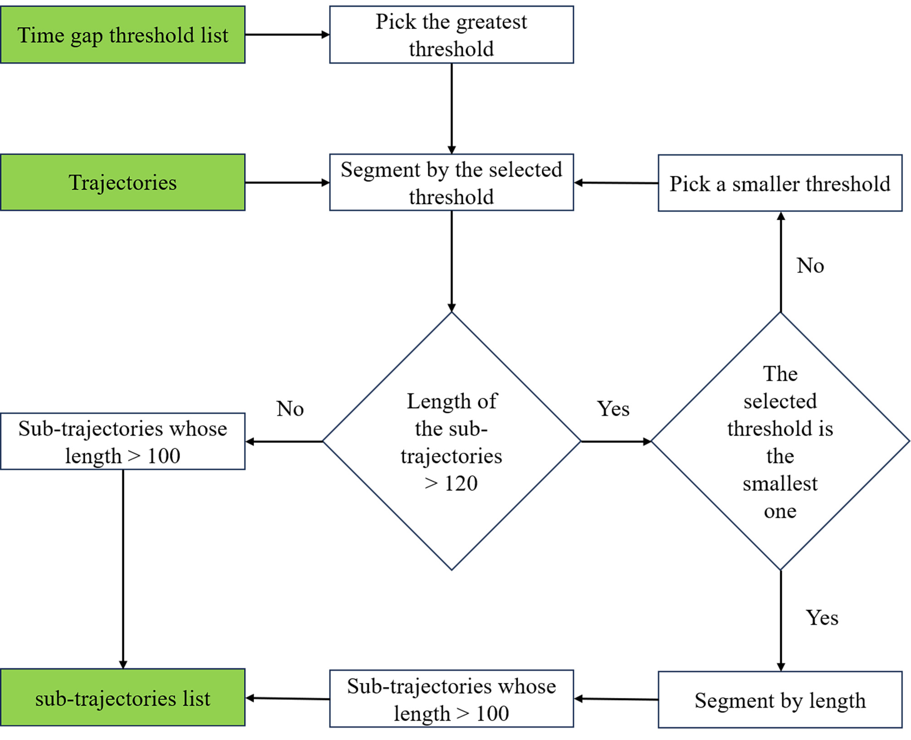

# A Comprehensive Framework Incorporating Deep Learning for Analyzing Fishing Vessel Activity Using AIS Data

## Features calculation

For features calculation, we perform some simple calculations to extract features from the AIS data.

The dataset about the distance to the offshore can be downloaded from [Global fishing watch](https://globalfishingwatch.org/data-download/datasets/public-distance-from-shore-v1).

The features calculation is in [features.py](features.py).

## Segmentation

We segment the AIS data according to the following process.

## Fishing vessel type classification

We used  [TransformerEncoder](TST.py) as our basic architecture to differentiate between trawlers, gillnetters, and purse seiners based on their AIS data.

The code is in [classifier](classifier.ipynb).

## Fishing behavior detection

For fishing behavior detection, we used the K-means algorithm with delay embedding, which we refer to as Temporal K-means.

The code is in [detection](detection.ipynb).

